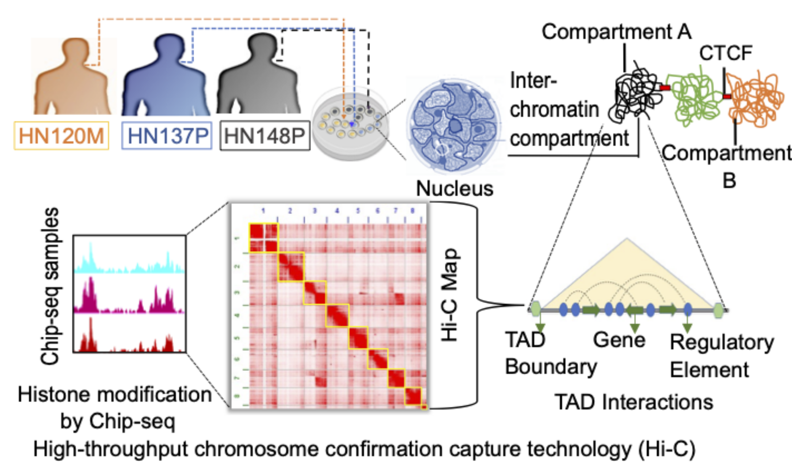
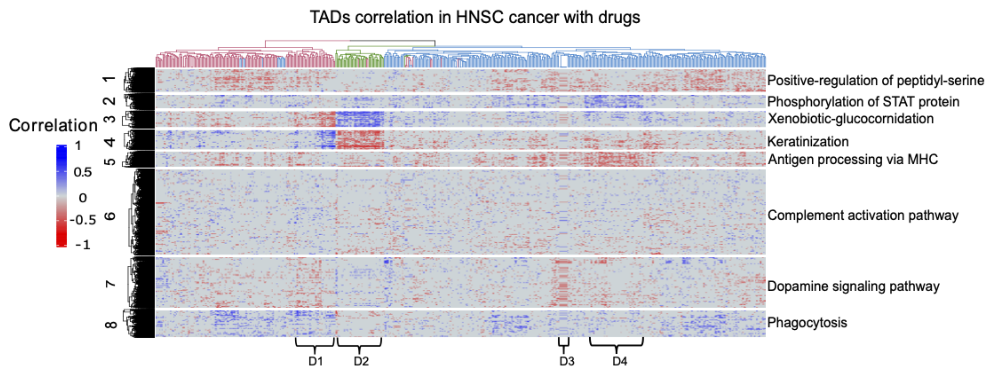
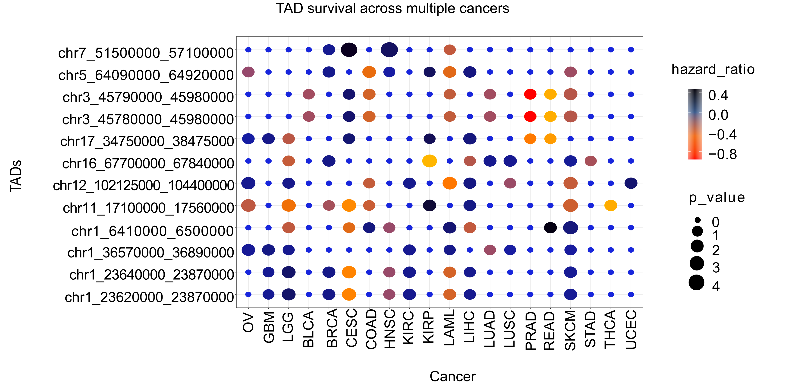
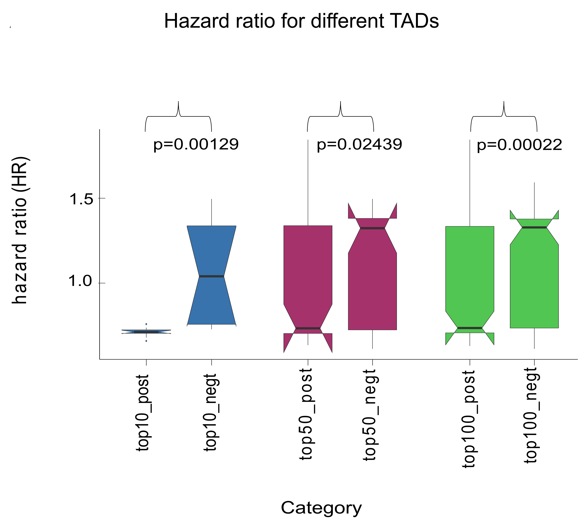
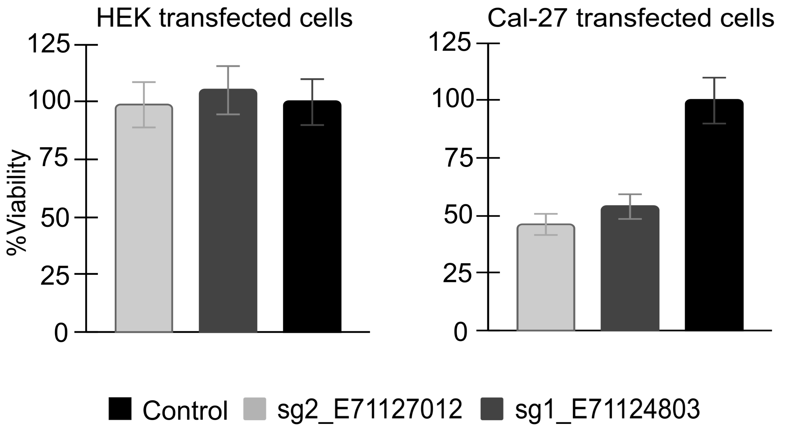
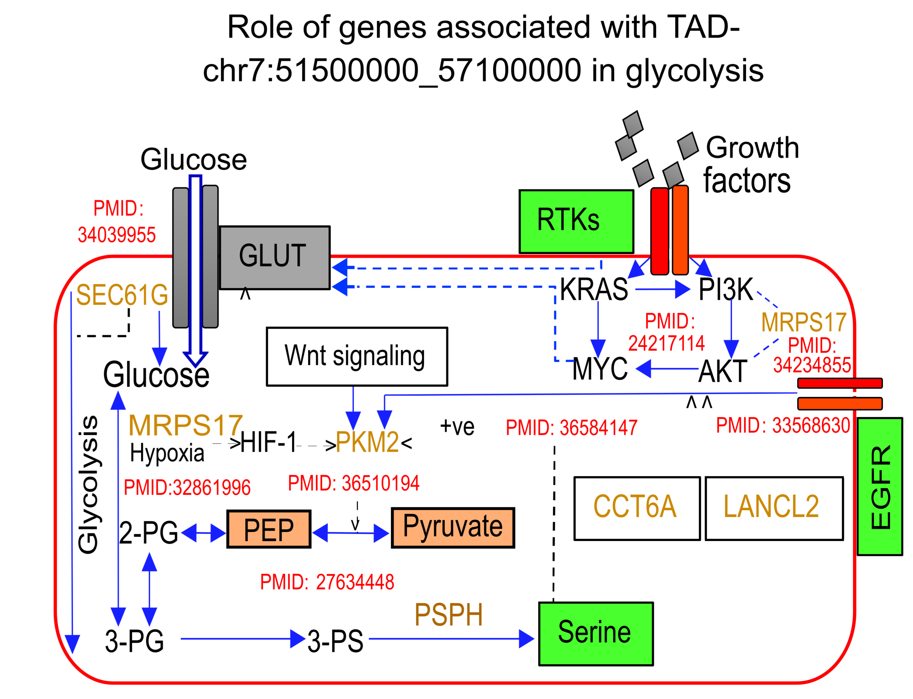

# Deciphering the phenotypic heterogeneity and drug response in cancer cells using activity and interactions in chromatin domains

Chromatin is known to be organized in the form of different domains, often called topologically associated domains (TAD). TADs are naturally defined genomic regions that are segregated. TADs have been found to be largely stable across cell-types and during differentiation. The effect of colocalization of genes in the topologically associated domains (TADs) and their activity orchestration in cancer samples and cells, go hand-in-hand with drug-response have not been comprehensively studied. Here, we analyzed patterns in the activity of TADs in cancer-cells along with chromatin interaction profiles to understand their modes of drug-response (check out our [**preprint**](https://www.biorxiv.org/content/10.1101/2023.01.15.524115v1) for details).

## Workflow
We initially performed analysis using chromatin interaction profiles of head and neck cancer (HNSC) cell lines. Specifically, we used head and neck squamous cell carcinoma (HNSC) - patient-derived primary cultures (PDCs) for this aim established by Chia et al. and used in other studies to understand drug-response of cancer cells. We profiled the chromatin interaction landscape for four HNSC cell lines to comprehend the genomic domain activation pattern in drug resistance. We expanded our study by analyzing the transcriptome of 819 cell lines reported in the CCLE database and the response for 544 drugs reported in the CTRPV2 portal. Further, we used our approach to draw inferences from transcriptome profiles of 9014 patients across 20 cancer types made available by the TCGA consortium.

### :eight_spoked_asterisk: Analysis of chromatin interaction profiles

     

A description of the profiling and analysis of the chromatin interaction profiles of three HNSC cell lines: metastatic cell line HN120M from patient HN120, primary tumor cells HN137P and HN148P from patients HN137 and HN148 respectively. The union list of TAD boundaries derived from Hi-C profiles of HNSC cell lines was used for downstream analysis.

### :eight_spoked_asterisk: Pattern of correlation between TAD activity and drug response

     

Heatmap-based illustration for correlation among TAD activity and PIC50 value for drugs in HNSC cell lines from CCLE database. Four sub-clusters of drugs are also highlighted here.

### :eight_spoked_asterisk: TAD activity across multiple cancer TCGA samples and survival association

     

Based on their P-values and hazard ratios for survival, some TADs patterns across PAN-cancer are graphically shown by dot plots.

### :eight_spoked_asterisk: Hazard-ratio distribution of TADs correlated with drug-response

     

Coherence between the association of TAD activity with survival among TCGA patients and the relationship between TAD and drug response in CCLE cell lines.

### :eight_spoked_asterisk: Case study of TADs in 11q13.3-11q13.4 region 

     

We looked for cis-regulatory sites in 11q13.3-4 TADs, which could be essential for HNSC cells. Two locations with high chromatin accessibility were found in TCGA-HNSC patients and overlapped with eRNA in HNSC samples. CRISPR based knockout using gRNA for those two locations decreased the viability of HNSC cell line Cal27 in contrast to control cells i.e., HEK293.

### :eight_spoked_asterisk: Case Study of TAD with EGFR gene

     

We also found that multiple genes in the EGFR-TAD have been shown to be associated with aerobic glycolysis and related processes. Such results indicate that genes in EGFR-TAD are promoting cell proliferation in two modes. The first mode is the activation of RTK pathways through EGFR. The second mode is by supporting aerobic glycolysis for the synthesis of biomolecules. 
